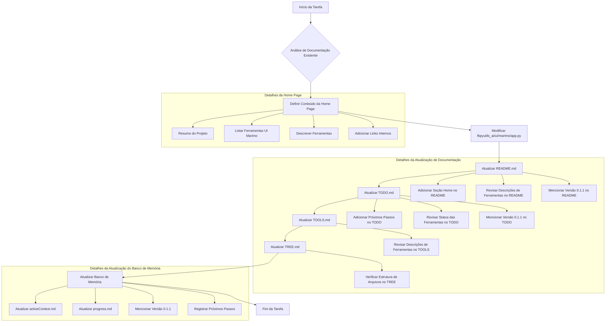

:start_line:1
-------
### Plano Detalhado

**Status da Release v0.1.1:** Todas as features previstas para esta release foram implementadas e testadas unitariamente e funcionalmente.

**Cobertura de Código Atual:** 36.56% (Meta: >= 90% para novas features/módulos revisados).

#### 1. Criar Conteúdo para a Sessão Home na UI Marimo
O objetivo é substituir o "Home: Not Implemented Yet" por um resumo do projeto e das ferramentas disponíveis, com links para suas respectivas sessões.

**Passos:**
1.  **Definir o Conteúdo da Home:**
    *   Resumo do projeto `FBPyUtils-AI`.
    *   Listagem das ferramentas disponíveis na UI Marimo (LLM, Search, Scrape).
    *   Breve descrição de cada ferramenta.
    *   Links internos para as seções de cada ferramenta na UI.
2.  **Modificar `fbpyutils_ai/ui/marimo/app.py`:**
    *   Atualizar a função `render_home_page` para retornar o conteúdo Markdown com o resumo e os links.

#### 2. Atualizar Documentação (README.md, TODO.md, TOOLS.md, TREE.md)
A documentação precisa refletir o estado atual do projeto, incluindo a nova página Home e a versão `0.1.1`.

**Passos:**
1.  **Atualizar `README.md`:**
    *   Adicionar uma seção sobre a página "Home" na UI Marimo, descrevendo seu propósito.
    *   Revisar as descrições das ferramentas para garantir que estejam alinhadas com a implementação atual.
    *   Garantir que a versão `0.1.1` seja mencionada como a release atual, se aplicável (o `README.md` não tem uma seção de versão explícita, mas posso adicionar uma nota ou garantir que o contexto geral reflita isso).
2.  **Atualizar `TODO.md`:**
    *   Revisar o status das ferramentas com base nas informações do `README.md` e `TOOLS.md`.
    *   Adicionar os seguintes próximos passos na seção "Key Actions":
        *   "Melhoria na interface da UI marimo com inclusao de novas funcinalidades e correcoes;"
        *   "Desenvolvimento das proximas ferramentas previstas ;"
        *   "Aumento da cobertura dos testes unitarios e funcionais."
    *   Garantir que a versão `0.1.1` seja mencionada como a release atual.
3.  **Atualizar `TOOLS.md`:**
    *   Revisar as descrições das ferramentas para garantir que estejam alinhadas com o `README.md` e o `TODO.md`.
    *   Adicionar qualquer nova informação relevante sobre as ferramentas ou a UI Marimo.
4.  **Atualizar `TREE.md`:**
    *   Verificar se a estrutura de arquivos e diretórios está 100% precisa. Não há mudanças estruturais diretas solicitadas, mas é bom confirmar.

#### 3. Atualizar Banco de Memória
O banco de memória precisa refletir as mudanças no projeto.

**Passos:**
1.  **Revisar e Atualizar `memory-bank/activeContext.md` e `memory-bank/progress.md`:**
    *   Descrever as mudanças implementadas (criação da página Home, atualização da documentação).
    *   Mencionar a versão `0.1.1` como a release atual.
    *   Registrar os próximos passos adicionados ao `TODO.md`.
    *   Garantir que outros arquivos do banco de memória (`projectbrief.md`, `productContext.md`, `systemPatterns.md`, `techContext.md`) estejam consistentes, embora não haja alterações diretas neles.

#### Diagrama do Plano:



#### 4. Implementar Sub-sessões "Generate Text" e "Generate Embeddings" na UI Marimo
O objetivo é adicionar as funcionalidades de geração de texto e embeddings na seção LLM da UI Marimo, utilizando os modelos configurados.

**Passos:**
1.  **Modificar `fbpyutils_ai/ui/marimo/app.py`:**
    *   Localizar a seção `llm_app_sections` (linha 119) onde as sub-sessões são definidas.
    *   Substituir `mo.md("Nothing!")` para "Generate Text" e "Generate Embeddings" por novas funções que renderizarão as interfaces de usuário para essas funcionalidades.
    *   **Para "Generate Text":**
        *   Criar uma função `get_llm_generate_text_section()` que retorne um `mo.ui.text_area` para o prompt de entrada e um `mo.md` ou `mo.plain_text` para exibir o resultado.
        *   Implementar a lógica para chamar `llm.generate_text()` com o prompt fornecido e exibir o resultado.
    *   **Para "Generate Embeddings":**
        *   Criar uma função `get_llm_generate_embeddings_section()` que retorne um `mo.ui.text_area` para o texto de entrada e um `mo.json` para exibir o array de embeddings.
        *   Implementar a lógica para chamar `llm.generate_embedding()` com o texto fornecido e exibir o resultado.
    *   Garantir que os modelos `llm_base_model` (para texto) e `llm_embed_model` (para embeddings) sejam utilizados corretamente.

#### 5. Re-atualizar Documentação
Após as modificações no código, a documentação precisa ser revisada para refletir as novas funcionalidades.

**Passos:**
1.  **Revisar `README.md`:**
    *   Atualizar a descrição da "LLM Tool" na seção "2.6 Marimo UI for AI Tools" para mencionar as novas funcionalidades de "Generate Text" e "Generate Embeddings".
2.  **Revisar `TODO.md`:**
    *   Atualizar o status da "Image Reading/Description Tool" e "Image Creation from Prompts Tool" se as novas implementações as afetarem indiretamente (embora o foco seja "Generate Text" e "Generate Embeddings", é bom verificar).
    *   Adicionar uma nota sobre a conclusão das sub-sessões "Generate Text" e "Generate Embeddings" na UI Marimo.
3.  **Revisar `TOOLS.md`:**
    *   Atualizar a descrição da "LLM Tool" para incluir as novas funcionalidades.
4.  **Revisar `TREE.md`:**
    *   Não são esperadas mudanças na estrutura de arquivos, mas verificar a consistência.

#### 6. Re-atualizar Banco de Memória
O banco de memória precisa refletir as novas funcionalidades e o progresso do projeto.

**Passos:**
1.  **Revisar e Atualizar `memory-bank/activeContext.md`:**
    *   Descrever a implementação das sub-sessões "Generate Text" e "Generate Embeddings".
    *   Atualizar os "Next Steps" para refletir o progresso.
2.  **Revisar e Atualizar `memory-bank/progress.md`:**
    *   Atualizar a seção "What Works" para incluir as novas funcionalidades da UI Marimo LLM.
    *   Revisar "What's Left to Build" e "Current Status" conforme o progresso.

#### Diagrama do Plano Atualizado:

```mermaid
graph TD
    A[Início da Tarefa] --> B{Análise de Feedback do Usuário};
    B --> C[Modificar fbpyutils_ai/ui/marimo/app.py];
    C --> C1[Implementar Generate Text UI];
    C --> C2[Implementar Generate Embeddings UI];
    C --> C3[Integrar Funções no llm_app_sections];
    C --> D[Revisar README.md];
    D --> E[Revisar TODO.md];
    E --> F[Revisar TOOLS.md];
    F --> G[Revisar TREE.md];
    G --> H[Atualizar Banco de Memória];
    H --> I[Fim da Tarefa];

    subgraph Detalhes da Implementação LLM UI
        C1 --> C1a[Criar get_llm_generate_text_section];
        C1a --> C1b[Usar mo.ui.text_area para input];
        C1b --> C1c[Usar mo.md/plain_text para output];
        C1c --> C1d[Chamar llm.generate_text()];

        C2 --> C2a[Criar get_llm_generate_embeddings_section];
        C2a --> C2b[Usar mo.ui.text_area para input];
        C2b --> C2c[Usar mo.json para output];
        C2c --> C2d[Chamar llm.generate_embedding()];
    end

    subgraph Detalhes da Re-atualização de Documentação
        D --> Da[Atualizar descrição LLM Tool];
        E --> Ea[Atualizar status LLM UI];
        F --> Fa[Atualizar descrição LLM Tool];
    end

    subgraph Detalhes da Atualização do Banco de Memória
        H --> H1[Atualizar activeContext.md];
        H --> H2[Atualizar progress.md];
    end
